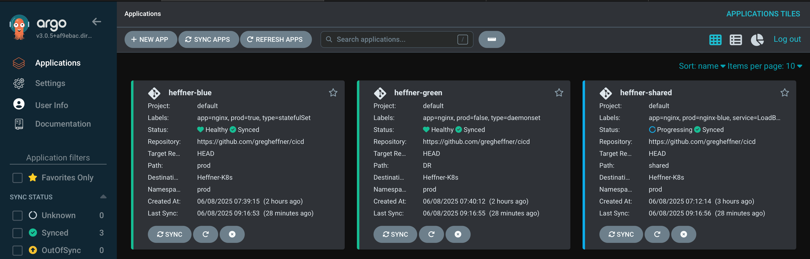
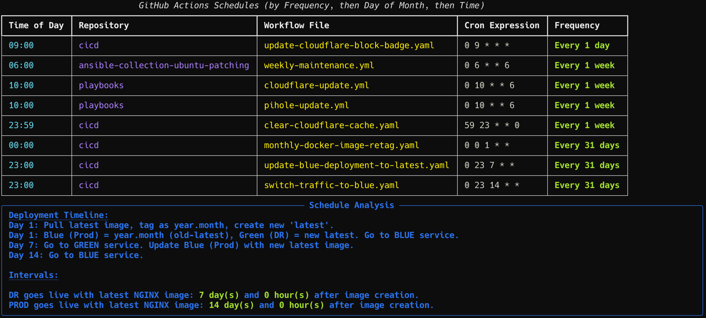

# cicd

This repository showcases a blue-green deployment strategy using Kubernetes, enabling seamless and low-risk application updates by running two separate environments: **green** (for new releases) and **blue** (for production).

## Actions for this repo

## Deployment Overview

- **Green Environment (Disaster Recovery)**
  - **Type:** DaemonSet
  - **Manifest:** `DR/nginx-green.yaml`
  - **Image:** [`technotuba/nginx:vYYYY.MM`](https://hub.docker.com/r/technotuba/nginx/tags)
  - **Purpose:** Runs the new version on every node for high availability, testing, and backup.

- **Blue Environment (Production)**
  - **Type:** StatefulSet
  - **Manifest:** `prod/nginx-blue.yaml`
  - **Image:** [`technotuba/nginx:latest`](https://hub.docker.com/r/technotuba/nginx/tags)
  - **Purpose:** Runs the stable production version with persistent storage and stable network identity.

This structure allows you to test updates thoroughly in the DR environment before promoting them to production, reducing risk and downtime during releases.

---

## Why DaemonSet for DR and StatefulSet for PROD?

- **DaemonSet:**  
  Ensures a pod runs on every node (or a subset), making it ideal for DR scenarios where you want the new version available cluster-wide for testing or failover.

- **StatefulSet:**  
  Manages stateful applications with stable identities and persistent storage. Perfect for production workloads that require reliability and data consistency.

---

## Key Differences

- **Deployment/StatefulSet:**  
  Controls the number of pod replicas, suitable for scaling stateless or stateful applications as needed.

- **DaemonSet:**  
  Guarantees a pod on every node, best for cluster-wide services or DR testing.

---

## Environment Separation

> **Note:**  
> Manifests for the green (DR) environment are in the `DR` folder, while blue (production) manifests are in the `prod` folder.

**Benefits of this separation:**

- **Clarity:** Instantly see which resources belong to which environment.
- **Safety:** Reduces the risk of accidental changes to production.
- **Simplicity:** Makes automation, CI/CD, and manual operations easier and less error-prone.
- **Clean Codebase:** Keeps your repository organized and maintainable.

---

> **Important:**  
> After deploying a new version, remember to update your service to point to the correct environment (green or blue) as needed.

## 🚀 CI/CD Workflows

| Workflow | Description | Trigger | Run |
|----------|-------------|---------|-----|
|  | Deletes pods in a specified Kubernetes namespace, optionally filtered by label selector. | Manual (`workflow_dispatch`) | [Run Workflow](../../actions/workflows/deletepods.yaml) |
|  | Updates the README badge with the current number of blocked Cloudflare IPs. | Scheduled & Manual | [Run Workflow](../../actions/workflows/cloudflareblock.yaml) |
|  | Clears build or deployment caches as needed. | Manual & Push | [Run Workflow](../../actions/workflows/cache-clear.yaml) |
|  | Switches deployment traffic to the blue environment. | Manual & Push | [Run Workflow](../../actions/workflows/switch-traffic-to-blue.yaml) |
|  | Switches deployment traffic to the green environment. | Manual & Push | [Run Workflow](../../actions/workflows/switch-traffic-to-green.yaml) |
|  | Tags the current green deployment as the latest. | Manual & Push | [Run Workflow](../../actions/workflows/push-green-to-latest.yaml) |
|  | Updates or retags images for deployments. | Manual & Push | [Run Workflow](../../actions/workflows/monthly-docker-image-retag.yaml) |
