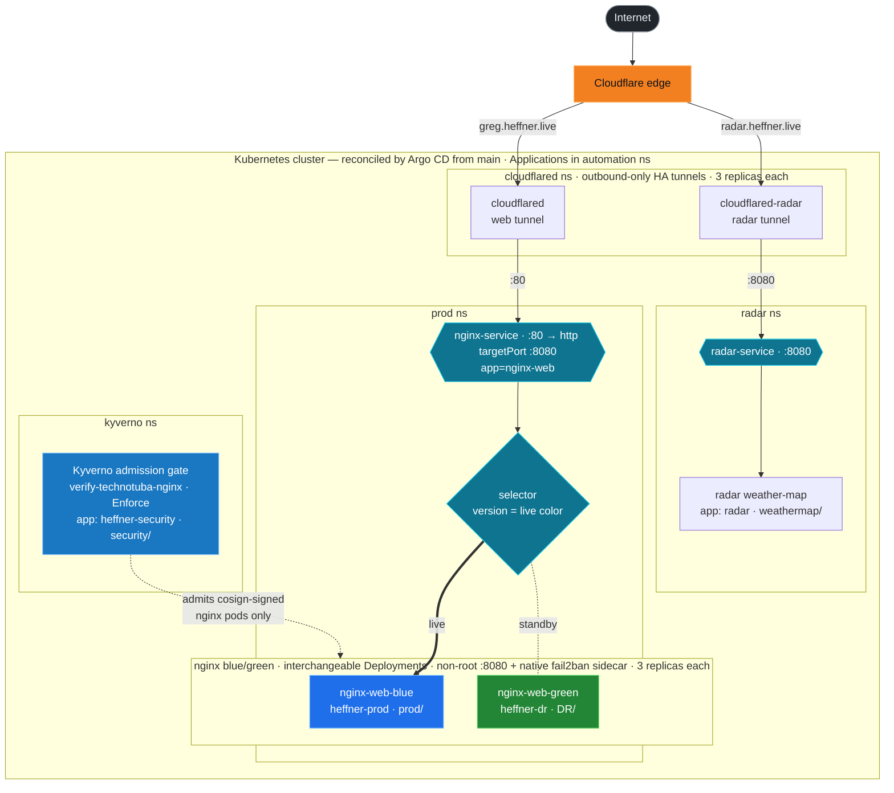

<div align="center">

# cicd

**GitOps + CI for `greg.heffner.live`**

A blue/green nginx delivery pipeline with a signed, gated, runtime-hardened stack.

[](#architecture)
[](#architecture)
[](#workflows)
[](#pipeline-and-supply-chain)
[](#pipeline-and-supply-chain)
[](#pipeline-and-supply-chain)


</div>

---

Source of truth for a small self-hosted Kubernetes cluster that serves two public sites
— the static site `greg.heffner.live` and the weather app `radar.heffner.live` — through
**in-cluster, highly-available Cloudflare Tunnels**. Argo CD reconciles the cluster
against `main`; the GitHub Actions workflows here build, sign, soak-test, and promote new
nginx images by committing to `main` (never imperatively). A new image does not go live
because it built — it must clear a vulnerability gate, get signed, run on the standby
color for 72 hours, and pass a second round of checks before any traffic moves to it.

> This README is the **what / how** overview. The [`documentation/`](documentation/README.md)
> deep dives (indexed under [Deep dives](#deep-dives)) cover the **why**.

---

## Overview

Blue/green: two identical Deployments, `nginx-web-blue` and `nginx-web-green` (3 replicas
each), sit side by side in the `prod` namespace, and one Service points at exactly one
color at a time. Promoting or rolling back is a one-line change to the Service selector,
committed to git. The repo holds two kinds of thing, both reconciled by Argo CD:

| | What | Reconciled by |
| --- | --- | --- |
| **Desired state** | Kubernetes manifests — tunnels, Deployments, Service, HPAs, PDBs, ServiceAccount, nginx config, admission policy | Argo CD from `main` |
| **Delivery logic** | GitHub Actions workflows that build, scan, sign, soak, gate, and flip | commits to `main` |

---

## Architecture

`heffner-prod` / `heffner-dr` are Argo CD **application names** for the `prod/` and
`DR/` paths — not namespaces. Both colors run in the `prod` namespace; the Service
selector decides which is live. `DR` is the standby (green) color, not a second cluster.


```mermaid
flowchart TB
    net(["Internet"]) --> cfe["Cloudflare edge"]
    cfe -->|"greg.heffner.live"| t1
    cfe -->|"radar.heffner.live"| t2

    subgraph cluster["Kubernetes cluster — reconciled by Argo CD from main · Applications in automation ns"]
        direction TB

        subgraph cfns["cloudflared ns · outbound-only HA tunnels · 3 replicas each"]
            direction LR
            t1["cloudflared<br/>web tunnel"]
            t2["cloudflared-radar<br/>radar tunnel"]
        end

        subgraph prodns["prod ns"]
            direction TB
            svc{{"nginx-service · :80 → http targetPort :8080<br/>app=nginx-web"}}
            sel{"selector<br/>version = live color"}
            subgraph colors["nginx blue/green · interchangeable Deployments · non-root :8080 + native fail2ban sidecar · 3 replicas each"]
                direction LR
                b["nginx-web-blue<br/>heffner-prod · prod/"]
                g["nginx-web-green<br/>heffner-dr · DR/"]
            end
            svc --> sel
            sel ==>|"live"| b
            sel -. "standby" .- g
        end

        subgraph radarns["radar ns"]
            direction LR
            rsvc{{"radar-service · :8080"}}
            rd["radar weather-map<br/>app: radar · weathermap/"]
            rsvc --> rd
        end

        subgraph kyns["kyverno ns"]
            ky["Kyverno admission gate<br/>verify-technotuba-nginx · Enforce<br/>app: heffner-security · security/"]
        end

        t1 -->|":80"| svc
        t2 -->|":8080"| rsvc
        ky -. "admits cosign-signed<br/>nginx pods only" .-> colors
    end

    classDef ext fill:#21262d,stroke:#8b949e,color:#e6edf3,stroke-width:1px;
    classDef edge fill:#f38020,stroke:#ffb86b,color:#0d1117,stroke-width:1px;
    classDef service fill:#0e7490,stroke:#22d3ee,color:#ffffff,stroke-width:1px;
    classDef gate fill:#1a78c2,stroke:#79c0ff,color:#ffffff,stroke-width:1px;
    classDef blue fill:#1f6feb,stroke:#79c0ff,color:#ffffff,stroke-width:1px;
    classDef green fill:#238636,stroke:#56d364,color:#ffffff,stroke-width:1px;
    class net ext
    class cfe edge
    class svc,rsvc,sel service
    class ky gate
    class b blue
    class g green
```

The nginx image is a hardened `technotuba/nginx` build whose Dockerfile is generated per
run by `.github/scripts/generate_dockerfile.py` (latest even-minor `alpine-slim`, base
pinned to an immutable `@sha256`, `apk upgrade`d — see [01 — supply chain](documentation/01-supply-chain.md)).

### Argo CD applications

| App | Path / chart | Dest ns | Reconciles |
| --- | --- | --- | --- |
| `cloudflared` | `cloudflared/` | `cloudflared` | Two HA tunnel Deployments (web + radar), 3 replicas each |
| `heffner-prod` | `prod/` | `prod` | `nginx-web-blue` Deployment |
| `heffner-dr` | `DR/` | `prod` | `nginx-web-green` Deployment (standby color) |
| `shared-services` | `shared/` | `prod` | Service (the blue/green switch), HPAs, PDBs, dedicated nginx ServiceAccount, nginx + fail2ban config, static content |
| `radar` | `weathermap/` | `radar` | `radar` weather-map app |
| `heffner-security` | `security/` | `kyverno` | Kyverno ClusterPolicy `verify-technotuba-nginx` |
| `kyverno` | Helm `3.8.1` | `kyverno` | Kyverno install (HA, image-verify cache) |
| `datadog-operator` | Helm `2.9.2` | `datadog` | Datadog Operator |
| `datadog-agent` | `datadog/` | `datadog` | `DatadogAgent` CR (pod-scraped metrics) |
| `external-secrets-operator` | Helm `2.7.0` | `external-secrets` | External Secrets Operator (CRDs + controller, HA) |
| `external-secrets-config` | `external-secrets/` | per-resource | `ClusterSecretStore` + the `ExternalSecret`s that sync secrets from 1Password |
| `nodelocaldns` | `nodelocaldns/` | `kube-system` | NodeLocal DNSCache DaemonSet (per-node DNS cache) |

`*-app.yaml` CRs are committed for `cloudflared`, `datadog-operator`,
`datadog-agent`, `kyverno`, `heffner-security`, `external-secrets-operator`,
`external-secrets-config`, and `nodelocaldns`; `heffner-prod`, `heffner-dr`,
`shared-services`, and `radar` are **bootstrap-once** (applied externally, not stored
here). All Applications live in the `automation` namespace.

Traffic enters through outbound-only `cloudflared` Deployments (no inbound ports). The
web tunnel routes to `nginx-service.prod.svc.cluster.local:80` (Service port 80 → named
`http` targetPort → the non-root container's `8080`); the radar tunnel to
`radar.radar.svc.cluster.local:8080`. Tunnel credentials are synced into Secrets from
1Password by External Secrets Operator (see [11 — secrets](documentation/11-secrets-management.md)).
See [06 — ingress](documentation/06-ingress.md).

### Runtime hardening

A web-server compromise is a dead end: nginx pods run **non-root** (`runAsUser 101`,
listeners on `8080`/`8081`), with **read-only rootfs**, **all capabilities dropped**, **no
service-account token**, on a **dedicated zero-RoleBinding `nginx` ServiceAccount**
(`shared/nginx-sa.yaml`). fail2ban is a **native, deprivileged sidecar** (initContainer +
`restartPolicy: Always`) that bans via the **Cloudflare API** — no `NET_ADMIN`/iptables —
and ignores Datadog synthetics. The origin also self-rate-limits (`limit_req`/`limit_conn`,
returns 429) as defense-in-depth. See [05 — pod security](documentation/05-pod-security.md),
[07 — intrusion response](documentation/07-intrusion-response.md),
[10 — caching & rate-limits](documentation/10-caching-and-rate-limits.md).

---

## Pipeline and supply chain

Two workflows, two phases, with a mandatory **72-hour soak** between building an image
and serving it. Every gate **fails closed** — the default outcome is no change.


```mermaid
flowchart LR
    start(["Weekly trigger<br/>Mon 07:00 UTC"]):::trig

    subgraph P1["Phase 1 · build-stage-scan — touches no live traffic"]
        direction LR
        b1["Generate Dockerfile<br/>+ build linux/amd64"]
        b2{"Trivy gate<br/>fixable HIGH/CRITICAL?"}
        b3["Push immutable<br/>vYYYY.MM.DD tag"]
        b4["cosign keyless<br/>sign + verify digest"]
        b5["Digest-pin<br/>standby manifest"]
        b6["Write candidate.json<br/>state=soaking · 72h clock"]
        b1 --> b2
        b2 -->|clean| b3 --> b4 --> b5 --> b6
    end

    soak{{"mandatory 72h soak on standby<br/>serves no production traffic"}}:::gate

    subgraph P2["Phase 2 · soak-gate-promote — daily 07:30 UTC"]
        direction LR
        g0{"Soaked ≥ 72h?"}
        g1{"Re-scan digest · fresh Trivy DB<br/>+ cosign re-verify pass?"}
        g2{"Drift · standby health<br/>· fence checks pass?"}
        g3["Atomic commit<br/>flip selector + ledger"]
        g4{"Post-flip<br/>smoke test"}
        g0 -->|yes| g1
        g1 -->|pass| g2
        g2 -->|"all pass"| g3 --> g4
    end

    hold(["No-op · wait<br/>re-check next daily run"]):::wait
    done(["state=promoted<br/>pin old color · colors converge"]):::ok
    fc["FAIL CLOSED<br/>no flip · traffic unchanged"]:::bad
    rb["Auto-rollback<br/>revert commit + confirm"]:::bad

    %% linear spine: build -> 72h soak -> promote -> live
    start --> b1
    b6 ==>|"72h gate"| soak ==> g0
    g4 -->|pass| done

    %% every fail-closed exit leaves a decision diamond
    b2 -->|"fixable HIGH/CRITICAL"| fc
    g0 -->|"not yet"| hold
    hold -.->|"next day"| g0
    g1 -->|"new CVE / bad signature"| fc
    g2 -->|"any check fails"| fc
    g4 -->|fail| rb
    rb --> fc

    classDef trig fill:#6e40c9,stroke:#0d1117,color:#fff;
    classDef gate fill:#bf8700,stroke:#0d1117,color:#fff;
    classDef ok fill:#2ea043,stroke:#0d1117,color:#fff;
    classDef bad fill:#da3633,stroke:#0d1117,color:#fff;
    classDef wait fill:#6e7681,stroke:#0d1117,color:#fff;
```

- **Phase 1 — `build-stage-scan`** (weekly, Mon 07:00 UTC): build → **Trivy** gate
  (fail on any fixable HIGH/CRITICAL) → push an immutable `vYYYY.MM.DD` tag (never
  `:latest`) → **cosign** keyless-sign + verify the digest → pin it into the standby
  manifest → record it in `candidate.json` with a 72h clock. Nothing touches live traffic.
- **Phase 2 — `soak-gate-promote`** (daily, 07:30 UTC): no-op until the candidate has
  soaked ≥ 72h, then **re-scan** the exact digest against a fresh Trivy DB, **re-verify**
  the cosign signature, check drift + standby health, and flip the Service selector +
  ledger state in one **atomic commit**. A post-flip smoke test auto-reverts on failure.
  (~72.5h build-to-live; see [02 — soak gate](documentation/02-soak-gate.md).)

The signer identity — pinned **OIDC issuer** + anchored **certificate-identity regexp** —
is verified at three points: **build**, **promote**, and **admission** (a Kyverno
`verify-technotuba-nginx` ClusterPolicy, Enforce + `failurePolicy: Fail`, scoped to the
nginx container only; the fail2ban sidecar is never matched). Kyverno runs 3 replicas with
a 60-minute verify cache, so a Sigstore/egress outage only blocks fresh, never-verified
digests. All image-touching workflows share the `nginx-pipeline` concurrency group, so
they never interleave. Trivy and cosign run as version- and SHA256-pinned binaries
(checksum-verified before install). Exact identity strings:
[01 — supply chain](documentation/01-supply-chain.md).

---

## Deep dives

The [`documentation/`](documentation/README.md) folder is the **why** companion to this
README — each page links to the committed manifest it describes.

| Theme | Pages |
| --- | --- |
| Supply chain | [01 — image build & trust](documentation/01-supply-chain.md) · [02 — 72-hour soak gate](documentation/02-soak-gate.md) |
| Availability | [03 — HA & zero-downtime rollouts](documentation/03-high-availability.md) · [04 — GitOps with Argo CD](documentation/04-gitops.md) · [12 — node-local DNS cache](documentation/12-dns-resilience.md) |
| Secrets | [11 — 1Password + External Secrets Operator](documentation/11-secrets-management.md) |
| Runtime security | [05 — pod hardening](documentation/05-pod-security.md) · [06 — Cloudflare Tunnel ingress](documentation/06-ingress.md) · [07 — edge banning](documentation/07-intrusion-response.md) · [10 — caching & rate-limits](documentation/10-caching-and-rate-limits.md) |
| Operations | [08 — health & observability](documentation/08-observability-and-health.md) · [09 — least-privilege housekeeping](documentation/09-operational-hygiene.md) |

---

## Workflows

Canonical reference for the 7 files in `.github/workflows/`.

| Workflow | Trigger (UTC) | Runner | Mutates cluster | Role |
| --- | --- | --- | :---: | --- |
| `build-stage-scan.yaml` | Mon 07:00 · manual | hosted | No (git only) | Build, Trivy gate, push immutable tag, cosign sign/verify, digest-pin standby, write `candidate.json`. |
| `soak-gate-promote.yaml` | Daily 07:30 · manual | self-hosted | No (git + ArgoCD refresh + health) | After 72h soak: re-scan, re-verify, gate checks, atomic selector flip, ArgoCD hard-refresh nudge, smoke test with auto-rollback. Fails closed. |
| `prune-registry-tags.yaml` | Mon 08:00 · manual | hosted | No | Set-logic Docker Hub cleanup; never deletes an in-use or rollback-reachable digest or its cosign `.sig`. Manual defaults to dry-run (set `apply=true` to delete); scheduled run applies. |
| `cloudflared-weekly-update.yaml` | Sun 08:00 · manual | self-hosted | Yes (rollout restart) | Rolls the `cloudflared` / `cloudflared-radar` Deployments to pick up the latest connector image. |
| `clear-cloudflare-cache.yaml` | Sun 23:59 · manual | hosted | No | Purges the Cloudflare edge cache (an optimization — HTML is short-TTL, so it self-heals in minutes). |
| `delete-kubernetes-pods.yaml` | Manual only | self-hosted | Yes (deletes pods) | Targeted pod cycling; excludes the `prod` and `automation` namespaces. |
| `log-rotate.yaml` | Manual only | self-hosted | Yes (truncates logs) | Truncates the nginx access/error logs on the nodes. |

---

## Repository layout

Folder-level map; see [CODEBASE_MAP.md](CODEBASE_MAP.md) for the file-by-file tour.

```text
cicd/
├── cloudflared/   HA Cloudflare Tunnels (web + radar), 3 replicas each   (app: cloudflared)
├── prod/          nginx-web-blue Deployment — non-root :8080/:8081 + native fail2ban sidecar
├── DR/            nginx-web-green Deployment — standby color, mirrors blue (-> prod ns)
├── shared/        Service (blue/green switch) + HPAs (pinned 3) + PDBs + nginx-sa.yaml
│                  (zero-RoleBinding SA) + nginx/fail2ban config + www-configmap.yaml
├── weathermap/    radar weather-map app                                  (app: radar)
├── security/      Kyverno ClusterPolicy + kyverno/heffner-security app CRs
├── datadog/       DatadogAgent CR + operator/agent app CRs               (ns: datadog)
├── external-secrets/ 1Password sync: ClusterSecretStore + ExternalSecrets (apps: external-secrets-*)
├── nodelocaldns/  NodeLocal DNSCache DaemonSet                           (app: nodelocaldns → kube-system)
├── DockerImage/   entrypoint scripts only (no Dockerfile/nginx.conf — both generated/external)
├── .github/       workflows/ · scripts/generate_dockerfile.py · state/candidate.json
│                  · dependabot.yml (weekly SHA-pin bumps for Actions)
├── documentation/ the "why" deep dives (see Deep dives above)
├── archive/       dormant, scaled-to-zero apps — not deployed, not Argo CD-managed
├── README.md
└── CODEBASE_MAP.md
```

`candidate.json` is the promotion ledger (candidate digest, standby/live colors, soak
clock, lifecycle state), committed to `main` atomically with the Service selector so the
cluster and ledger cannot disagree — making promotion idempotent and resumable after a
crash. Operator runbooks and internal design docs are deliberately gitignored (`ops-local/`).

---

## Operations

- **Zero-downtime promotion, instant rollback.** Promotion/rollback is a one-line
  Service-selector change; reverting the commit moves all traffic back.
- **HA ingress.** The Cloudflare Tunnels run as in-cluster Deployments (3 replicas each,
  spread across nodes), so losing a node does not drop the public endpoints.
- **Synced ≠ Healthy.** Argo CD reconciles continuously from `main`; *Synced* (git matches
  cluster) is not *Healthy* (pods Ready), so health is checked before any flip.
- **Both colors converge.** After a promote, the previously live color is pinned to the
  same digest, so blue and green run identical images and either can go next.
- **Graceful disruption.** Per-color PodDisruptionBudgets cap disruption at one pod; HPAs
  are pinned `min=max=3` (anti-flap) and required one-pod-per-node scheduling lets a
  drained node refill on return. See [03 — high availability](documentation/03-high-availability.md).

Operator runbooks and break-glass procedures are kept out of this public repository.

---

## References

- [Argo CD — automated sync and self-heal](https://argo-cd.readthedocs.io/en/latest/user-guide/auto_sync/)
- [Cloudflare Tunnel — replica/HA model](https://developers.cloudflare.com/cloudflare-one/connections/connect-networks/configure-tunnels/tunnel-availability/)
- [cosign — keyless signing](https://docs.sigstore.dev/cosign/signing/overview/) · [Sigstore — security model](https://docs.sigstore.dev/about/security/)
- [Kyverno — verify images with Sigstore](https://kyverno.io/docs/policy-types/cluster-policy/verify-images/sigstore/)
- [Trivy — vulnerability scanner](https://trivy.dev/docs/latest/scanner/vulnerability/) · [SLSA — supply-chain levels](https://slsa.dev/)
