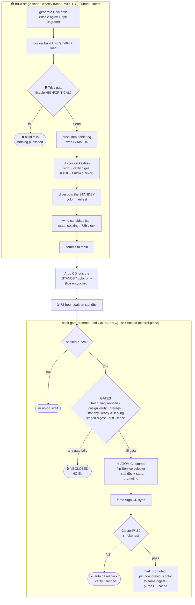

<div align="center">

# 🔵🟢 cicd — GitOps + CI for `greg.heffner.live`

**Weekly build → 3-day soak → gated auto-promote. Zero-downtime blue/green delivery for a self-hosted Kubernetes cluster.**


</div>

---

## 📖 Overview

Every image is digest-pinned, Trivy-gated, cosign-signed, and **soaked on the standby color for 72 hours before it can ever serve a live request.**

This repository is the **single source of truth** for a self-hosted Kubernetes cluster that serves the static site **`greg.heffner.live`** (nginx) to the public internet through a **Cloudflare Tunnel**.

It holds two things:

1. **GitOps manifests** — the desired cluster state, continuously reconciled by **Argo CD** (auto-sync + selfHeal, tracking `main`).
2. **CI/CD workflows** — GitHub Actions that build a freshly-patched nginx image weekly, vet it, and *automatically* promote it to live traffic only after it survives a multi-day soak.

The headline design goal: **a poisoned, yanked, or regressed upstream OS package must never reach a visitor.** Deploys never go straight to live. A new build lands on the *standby* color, soaks there for three days, is re-scanned and re-verified, and only then does live traffic flip to it — atomically, with automatic rollback if the post-flip smoke test fails.

> **Deploys happen by committing to `main`.** Nothing is `kubectl apply`-ed by hand and no workflow pushes images on a code push — Argo CD reconciles whatever the workflows commit.

---

## 🧭 Architecture at a glance

```
Internet ──▶ Cloudflare Tunnel (cloudflared on the control-plane node)
                    │
                    ▼
        node nodePort 32317  (LoadBalancer-assigned, stable)
                    │
                    ▼
        Service  nginx-service  (type: LoadBalancer, externalTrafficPolicy: Cluster)
                    │
        selector { version: blue | green }   ◀── flipping this selector = switching LIVE color
            ┌───────┴───────┐
            ▼               ▼
     Deployment        Deployment
   nginx-web-blue    nginx-web-green
   (prod/, repl 3)    (DR/, repl 3)
            └───────┬───────┘
                    ▼
   per-color HPA (cpu 70%, 3→10) + PDB (maxUnavailable: 1)  [shared/]
```

> Each pod runs an **nginx** container alongside a **`crazymax/fail2ban`** sidecar.

- **Both colors are Kubernetes `Deployment`s** (`replicas: 3`) in namespace `prod`. Blue lives in `prod/nginx-blue.yaml`; green lives in `DR/nginx-green.yaml`. They are symmetric and equally promotable.
- **The Service selector decides which color is LIVE.** Switching colors means changing `spec.selector.version` on `nginx-service` — nothing else moves.
- Each pod's **nginx** container is digest-pinned (`imagePullPolicy: IfNotPresent`, `httpGet / :80` readiness probe, `preStop` drain + `terminationGracePeriodSeconds`, surge-first rollout `maxSurge: 1 / maxUnavailable: 0`, cpu request `250m` / limit `1`). The **fail2ban** sidecar bans abusive IPs via the Cloudflare API, reading nginx logs and trusting the real client IP from `X-Forwarded-For`.
- Per-color **HorizontalPodAutoscaler** (cpu Utilization 70%, min 3 / max 10) and **PodDisruptionBudget** (`maxUnavailable: 1`) live in `shared/`.

### The image

`technotuba/nginx` (Docker Hub, public). Built weekly from `nginx:<STABLE>-alpine-slim` by `.github/scripts/generate_dockerfile.py`, which resolves the latest **stable** (even-minor) nginx branch and runs `apk upgrade --no-cache` to pull patched Alpine OS packages — so the rebuild ships current security fixes even when the upstream base image lags.

### GitOps topology (Argo CD, namespace `automation`)

| Argo CD Application | Source path | Tracks |
|---|---|---|
| `heffner-prod` | `prod/` | blue Deployment |
| `heffner-dr` | `DR/` | green Deployment |
| `shared-services` | `shared/` | Service + HPAs + PDBs + ConfigMaps |

---

## 🚦 The pipeline

Two GitHub Actions workflows are the centerpiece. **The weekly build *stages* a candidate on standby; after 72h of soak, a daily gated job atomically flips live traffic to it — or no-ops.** The live color is never touched by the build.


```mermaid
flowchart TD
    subgraph WEEKLY["🛠️ build-stage-scan · weekly (Mon 07:00 UTC) · ubuntu-latest"]
        A["generate Dockerfile<br/>(stable nginx + apk upgrade)"] --> B["docker build linux/amd64 + load"]
        B --> C{"🛡️ Trivy gate<br/>fixable HIGH/CRITICAL?"}
        C -- fail --> CX(["❌ build fails<br/>nothing published"])
        C -- clean --> D["push immutable tag<br/>:vYYYY.MM.DD"]
        D --> E["✍️ cosign keyless<br/>sign + verify digest<br/>(OIDC / Fulcio / Rekor)"]
        E --> F["digest-pin the STANDBY<br/>color manifest"]
        F --> G["write candidate.json<br/>state: soaking · 72h clock"]
        G --> H["commit to main"]
    end

    H --> I["Argo CD rolls the<br/>STANDBY color only<br/>(live untouched)"]
    I --> SOAK["⏳ 72-hour soak on standby"]

    SOAK --> J

    subgraph DAILY["🚀 soak-gate-promote · daily (07:30 UTC) · self-hosted (control-plane)"]
        J{"soaked ≥ 72h?"}
        J -- no --> JX(["💤 no-op, wait"])
        J -- yes --> K{"GATES<br/>fresh Trivy re-scan ·<br/>cosign verify · prereqs ·<br/>standby Ready & serving<br/>staged digest · drift · fence"}
        K -- any gate fails --> KX(["🔒 fail CLOSED<br/>NO flip"])
        K -- all pass --> L["⚛️ ATOMIC commit:<br/>flip Service selector<br/>→ standby + state: promoting"]
        L --> M["force Argo CD sync"]
        M --> N{"ClusterIP :80<br/>smoke test"}
        N -- fail --> O(["↩️ auto git rollback<br/>+ verify it landed"])
        N -- pass --> P["mark promoted ·<br/>pin now-previous color<br/>to same digest ·<br/>purge CF cache"]
    end
```

### 1️⃣ `build-stage-scan.yaml` — weekly stage (no cluster mutation)

> Mondays 07:00 UTC · `runs-on: ubuntu-latest`

1. **P0 refuse gate** — bails if *either* live manifest still references a mutable `:latest` nginx tag (which would let an unsoaked image reach live on any pod restart).
2. Resolve the **live** color from the committed Service selector and derive the **standby** color.
3. Generate the Dockerfile (stable nginx + `apk upgrade`), then **build single-arch `linux/amd64` and load locally** (single-arch is load-bearing — the running pod's `imageID` digest equals the manifest digest, which is how the promote gate proves the standby is serving the staged image).
4. **🛡️ Trivy gate** — fail the build on any **fixable** `HIGH`/`CRITICAL`, *before* anything is published.
5. **Push only the immutable tag** `:vYYYY.MM.DD` (never `:latest`).
6. **✍️ cosign keyless sign + verify** the digest via GitHub OIDC → Fulcio → Rekor.
7. **Digest-pin** the standby color's nginx container to `technotuba/nginx@sha256:…` (the fail2ban sidecar is never touched).
8. Write `.github/state/candidate.json` (`state: soaking`, 72h promote-eligible clock) and **commit to `main`**. Argo CD then rolls **only the standby** color.

### 2️⃣ `soak-gate-promote.yaml` — daily gated promote

> Daily 07:30 UTC · `runs-on: self-hosted` (control-plane node, has `kubectl`)

If a candidate has soaked **≥ 72h**, every gate must pass before the flip — and **every gate fails closed** (no flip):

- **Fresh-DB Trivy re-scan** of the exact staged digest (catches CVEs disclosed *during* the soak).
- **cosign verify** the staged digest (identity pinned to `build-stage-scan.yaml@refs/heads/main`).
- **Cluster prereqs** — `externalTrafficPolicy: Cluster`, incoming color is a `Deployment`, nginx `readinessProbe` present, incoming color has an HPA.
- **Standby health** — pods `Ready` *and* actually serving the staged digest, with ≥ 1 ready endpoint.
- **Drift gate** — committed selector == live selector == expected pre-flip color.
- **Fence** — the ledger is unchanged since the gates began.

Then: **one atomic commit** flips the Service selector to the standby color and sets `state: promoting` → force Argo CD sync → **ClusterIP smoke test** (`http://<clusterIP>:80/`) with **automatic git rollback (and verification that the rollback landed)** on failure → mark `promoted` and pin the now-previous color to the same digest → purge the Cloudflare cache.

### 🗂️ State machine — `.github/state/candidate.json`

The promotion ledger and the cluster's source of truth (the selector) can never disagree, because the flip moves both in a single commit.

```
soaking ──▶ promoting ──▶ promoted
                 └──────▶ rolled_back   (smoke test failed after flip)
```

<details>
<summary>Example ledger</summary>

```json
{
  "schema": 3,
  "immutable_tag": "vYYYY.MM.DD",
  "digest": "sha256:…",
  "image_ref": "technotuba/nginx@sha256:…",
  "standby_color": "green",
  "standby_object": "deployment/nginx-web-green",
  "standby_file": "DR/nginx-green.yaml",
  "live_color_at_build": "blue",
  "build_scan_status": "pass",
  "cosign_signed": true,
  "promote_eligible_after_epoch": 0,
  "state": "promoted",
  "run_url": "https://github.com/gregheffner/cicd/actions/runs/…"
}
```
</details>

---

## 🔐 Security & supply chain

What the whole pipeline guarantees:

- **🔗 No mutable image in production.** The nginx application image is referenced by immutable digest (`technotuba/nginx@sha256:…`), never `:latest` — a P0 gate in *both* workflows refuses to run if a live manifest is on `:latest`. *(The `crazymax/fail2ban` sidecar tracks the vendor's `:latest` by design and sits outside the soak/promote path.)*
- **🛡️ A vulnerable image cannot publish — or promote.** Trivy gates on fixable `HIGH`/`CRITICAL` at build, and a fresh-DB re-scan of the exact staged digest runs again at promote time, so CVEs disclosed *during* the soak still block the flip.
- **⏳ Nothing serves live until it has survived 72h on standby.** This soak window is where a poisoned or yanked upstream package gets caught — before any visitor is exposed.
- **✍️ Every live image is signed and verified.** cosign keyless (GitHub OIDC / Fulcio / Rekor), with the signer identity pinned to this repo's build workflow on `main`, checked at build and again before the flip.
- **🔒 The flip is fail-closed and reversible.** Health, drift, prereq, and fence checks all default to "no flip"; the flip is one atomic commit, and a failed post-flip smoke test triggers an automatic, *verified* rollback.

---

## ⚙️ Workflows

All workflows are GitHub Actions. **None are push-triggered.** `workflow_dispatch` (manual "Run workflow") is available on every workflow.

| Workflow | Trigger | Runner | What it does |
|---|---|---|---|
| `build-stage-scan.yaml` | Weekly cron (Mon 07:00 UTC) + manual | `ubuntu-latest` | Build patched nginx → Trivy gate → push immutable tag → cosign sign/verify → digest-pin standby → write ledger (`soaking`) → commit. *No cluster mutation.* |
| `soak-gate-promote.yaml` | Daily cron (07:30 UTC) + manual | `self-hosted` | If soaked ≥ 72h: re-scan, cosign verify, prereq/health/drift/fence gates → atomic selector flip → smoke test → rollback-on-failure → mark promoted. *Fails closed.* |
| `clear-cloudflare-cache.yaml` | Scheduled cron + manual | `ubuntu-latest` | Scheduled Cloudflare cache purge. |
| `update-cloudflare-block-badge.yaml` | Scheduled cron + manual | `ubuntu-latest` | Updates a README badge with the Cloudflare block count. |
| `delete-kubernetes-pods.yaml` | Manual (namespace input) | `self-hosted` | Pod cleanup; the bulk "all" sweep excludes `prod` & `automation` (live traffic / Argo CD). |
| `log-rotate.yaml` | Manual | `self-hosted` | Truncates nginx logs. |
| `tunnelrestart.yml` | Manual | `self-hosted` | Restarts the Cloudflare Tunnels. |
| `push-cloudflare-credentials.yaml` | Manual | `ubuntu-latest` | Pushes Cloudflare credentials for the fail2ban sidecar. |

---

## 🗂️ Repository layout

```
.
├── prod/
│   └── nginx-blue.yaml            # BLUE Deployment (replicas 3) — Argo CD app: heffner-prod
├── DR/
│   └── nginx-green.yaml           # GREEN Deployment (replicas 3) — Argo CD app: heffner-dr
├── shared/                        # Argo CD app: shared-services
│   ├── nginx-service.yaml         # nginx-service (LoadBalancer, ETP: Cluster) — selector = LIVE color
│   ├── nginx-pdb.yaml             # per-color PodDisruptionBudgets (maxUnavailable: 1)
│   ├── nginx-config.yaml          # nginx.conf / status.conf ConfigMap
│   ├── www-configmap.yaml         # the static site content
│   ├── fail2ban-config.yaml       # jail.local + nginx-404 filter
│   ├── fail2ban-main-config.yaml  # fail2ban.conf
│   └── fail2ban-cloudflare-ban-script.yaml
├── DockerImage/                   # entrypoint + docker-entrypoint.d/ copied into the image
├── .github/
│   ├── workflows/                 # the workflows above
│   ├── scripts/
│   │   └── generate_dockerfile.py # resolves stable nginx + apk upgrade → Dockerfile
│   └── state/
│       └── candidate.json         # promotion ledger / state machine
└── docs/
    ├── blue-green-soak-redesign.md
    └── cosign-hardening-plan.md
```

---

## 📚 Design docs & runbooks

The reasoning, prerequisites, and runbooks behind this pipeline live in [`docs/`](docs/):

- **[`blue-green-soak-redesign.md`](docs/blue-green-soak-redesign.md)** — the weekly-build / soak / auto-promote blue/green design and the P0–P5 prerequisites it depends on.
- **[`cosign-hardening-plan.md`](docs/cosign-hardening-plan.md)** — the keyless signing + verification hardening plan and pinned-identity rationale.

---

<div align="center">
<sub>GitOps with Argo CD · CI with GitHub Actions · hardened with Trivy + cosign + a 72-hour soak.</sub>
</div>
