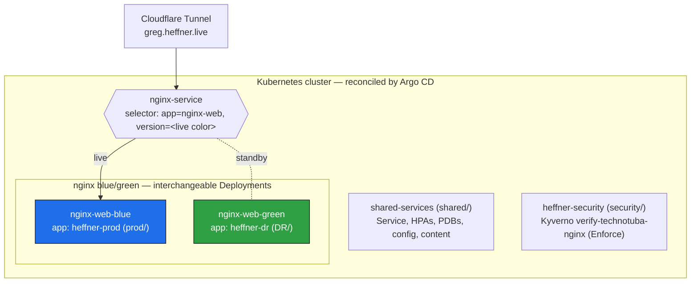

<div align="center">

# cicd

**GitOps + CI for `greg.heffner.live`**

A blue/green nginx delivery pipeline with a signed, gated supply chain.

[](#architecture)
[](#architecture)
[](#workflows)
[](#security-and-supply-chain)
[](#security-and-supply-chain)
[](#security-and-supply-chain)


</div>

---

This repository is the source of truth for a small self-hosted Kubernetes cluster
that serves the static site `greg.heffner.live` to the public through a Cloudflare
Tunnel. Argo CD reconciles the cluster against the `main` branch; the GitHub
Actions workflows here build, sign, soak-test, and promote new nginx images. The
workflows never touch the cluster imperatively — they commit to `main`, and Argo
CD applies the change.

A new image does not go live because it built. It has to clear a vulnerability
gate, get signed, run on the standby color for 72 hours, and pass a second round
of checks before any traffic moves to it.

---

## Overview

The site runs blue/green: two identical Deployments, `nginx-web-blue` and
`nginx-web-green`, sit side by side, and a single Service points at exactly one
color at a time. Promoting a new image or rolling back is a one-line change to the
Service's `version` selector, committed to git.

The repository holds two kinds of thing, both reconciled by Argo CD:

| | What | Reconciled by |
| --- | --- | --- |
| **Desired state** | Kubernetes manifests — Deployments, Service, HPAs, PDBs, nginx config, admission policy | Argo CD from `main` |
| **Delivery logic** | GitHub Actions workflows that build, scan, sign, soak, gate, and flip | commits to `main` |

---

## Architecture

> [!NOTE]
> `heffner-prod` and `heffner-dr` are Argo CD **application names** mapped to the
> `prod/` and `DR/` paths — not Kubernetes namespaces. Both nginx colors are
> Deployments that run side by side; the Service selector decides which one is live.


```mermaid
flowchart TB
    cf["Cloudflare Tunnel<br/>greg.heffner.live"] --> svc
    subgraph cluster["Kubernetes cluster — reconciled by Argo CD"]
        direction TB
        svc{{"nginx-service<br/>selector: app=nginx-web, version=&lt;live color&gt;"}}
        subgraph colors["nginx blue/green — interchangeable Deployments"]
            direction LR
            b["nginx-web-blue<br/>app: heffner-prod (prod/)"]
            g["nginx-web-green<br/>app: heffner-dr (DR/)"]
        end
        svc -->|live| b
        svc -. standby .- g
        cfg["shared-services (shared/)<br/>Service, HPAs, PDBs, config, content"]
        ky["heffner-security (security/)<br/>Kyverno verify-technotuba-nginx (Enforce)"]
    end
    classDef blue fill:#1f6feb,stroke:#0d1117,color:#fff;
    classDef green fill:#2ea043,stroke:#0d1117,color:#fff;
    class b blue
    class g green
```

The image is a hardened `technotuba/nginx` build. The Dockerfile is generated on
each run: it selects the latest stable even-minor nginx `alpine-slim` release,
pins the base to an immutable `@sha256` digest, runs `apk upgrade` for current OS
patches, and fixes entrypoint permissions after `COPY`. Each color also runs an
unmodified `fail2ban` sidecar that the pipeline never builds or signs.

| Argo CD app | Path | Reconciles |
| --- | --- | --- |
| `heffner-prod` | `prod/` | `nginx-web-blue` Deployment |
| `heffner-dr` | `DR/` | `nginx-web-green` Deployment (cross-node anti-affinity) |
| `shared-services` | `shared/` | Service (the blue/green switch), HPAs, PDBs, nginx config, static content |
| `heffner-security` | `security/` | Kyverno ClusterPolicy |
| `kyverno` | `security/` | Kyverno install (HA, image-verify cache) |

---

## Pipeline

Two workflows, two phases, with a mandatory 72-hour soak between building an image
and serving it.


```mermaid
flowchart LR
    subgraph P1["build-stage-scan — weekly, Mon 07:00 UTC"]
        direction TB
        a1["generate Dockerfile + build (linux/amd64)"] --> a2["Trivy gate: fixable HIGH/CRITICAL -> fail"]
        a2 --> a3["push immutable vYYYY.MM.DD tag"]
        a3 --> a4["cosign keyless sign + verify"]
        a4 --> a5["digest-pin standby manifest"]
        a5 --> a6["write candidate.json (soaking, 72h clock)"]
    end
    a6 ==>|72h soak| s
    subgraph P2["soak-gate-promote — daily, 07:30 UTC"]
        direction TB
        s{"soak >= 72h?"} -->|no| noop["no-op"]
        s -->|yes| g1["re-scan (fresh DB) + cosign re-verify"]
        g1 --> g2["drift, standby health, fence checks"]
        g2 -->|any fail| nf["fail closed: no flip"]
        g2 -->|all pass| flip["atomic commit: selector flip + state"]
        flip --> smoke{"smoke test"}
        smoke -->|fail| rb["revert + confirm it landed"]
        smoke -->|pass| done["state=promoted, pin old color"]
    end
    classDef ok fill:#2ea043,stroke:#0d1117,color:#fff;
    classDef bad fill:#da3633,stroke:#0d1117,color:#fff;
    class done,flip ok
    class nf,rb bad
```

**Phase 1 — `build-stage-scan`** builds the image, fails on any fixable
HIGH/CRITICAL from Trivy, pushes an immutable `vYYYY.MM.DD` tag (never `:latest`),
signs and verifies the digest with cosign, pins it into the standby color's
manifest, and records it in `candidate.json` with a 72-hour clock. Nothing touches
live traffic.

**Phase 2 — `soak-gate-promote`** runs daily and does nothing until the candidate
has soaked for 72 hours. Once it has, it re-scans the exact digest against a fresh
database, re-verifies the signature, checks drift and standby health, then flips
the Service selector and the ledger state in a single atomic commit. A smoke test
runs after the flip; if it fails, the workflow reverts the commit and confirms the
revert landed. Every gate fails closed — the default outcome is no change.

---

## Security and supply chain

The same signer identity is verified at three independent points: build, promote,
and admission.

| Control | Where | Behavior |
| --- | --- | --- |
| Trivy build gate | build | Image scanned before push; fails on any fixable HIGH/CRITICAL, so nothing publishes. |
| Trivy re-scan | promote | Fresh-database re-scan of the staged digest, to catch CVEs disclosed during the soak. |
| cosign keyless signing | build | Signs the pushed digest via GitHub OIDC with a short-lived Fulcio cert; the signature is logged in Rekor. No long-lived key. |
| cosign verify | build · promote · admission | Verified against the same pinned identity at all three points. |
| Kyverno ClusterPolicy | runtime | `verify-technotuba-nginx` runs in Enforce with `failurePolicy: Fail`; rejects any matching pod not signed by the trusted identity. |
| Digest pinning | build · promote | Refuses to build or promote while either manifest still references a mutable `:latest`; only `@sha256` pins with `IfNotPresent`. |
| Scope | both | Policy and manifest edits match the nginx container by name only; the `fail2ban` sidecar is never matched. |
| Tool integrity | promote | Trivy and cosign run as version-pinned binaries, SHA256-verified before use. |

Fulcio is a public CA, so a valid signature on its own only proves *signed by
someone*. Verification therefore pins both the OIDC issuer and an anchored identity
regexp:

```
# OIDC issuer
https://token.actions.githubusercontent.com

# Certificate identity (one workflow, on main)
https://github.com/gregheffner/cicd/.github/workflows/build-stage-scan.yaml@refs/heads/main
```

Kyverno runs three admission replicas with a 60-minute image-verify cache, so a
Sigstore or egress outage only blocks fresh, never-verified digests — pods that
already passed verification keep serving.

---

## Schedule

| Cron (UTC) | Workflow | Cadence | Action |
| --- | --- | --- | --- |
| `0 7 * * 1` | `build-stage-scan.yaml` | Weekly · Mon 07:00 | Build, scan, sign, pin standby, start the 72h clock |
| `30 7 * * *` | `soak-gate-promote.yaml` | Daily · 07:30 | Gate and flip once a candidate has soaked >= 72h |
| `0 9 * * *` | `update-cloudflare-block-badge.yaml` | Daily · 09:00 | Refresh the Cloudflare-blocks badge |
| `59 23 * * 0` | `clear-cloudflare-cache.yaml` | Weekly · Sun 23:59 | Purge the Cloudflare edge cache |

With a Monday 07:00 build and a 72-hour clock, the candidate becomes eligible on
Thursday at 07:00, so the first daily promote run that can flip it is Thursday
07:30 — about **72.5 hours** from build to live. The promote job is a no-op until
then, and a CVE disclosed during the soak is caught by the promote-time re-scan.

---

## Workflows

| Workflow | Trigger | Mutates cluster | Role |
| --- | --- | :---: | --- |
| `build-stage-scan.yaml` | Mon 07:00 UTC · manual | No (git only) | Build, Trivy gate, push immutable tag, cosign sign/verify, digest-pin standby, write `candidate.json`. |
| `soak-gate-promote.yaml` | Daily 07:30 UTC · manual | No (git + read-only health) | After 72h soak: re-scan, re-verify, gate checks, atomic selector flip, force sync, smoke test with auto-rollback. Fails closed. |
| `update-cloudflare-block-badge.yaml` | Daily 09:00 UTC · manual | No | Patches the live block count into this README's badge. |
| `clear-cloudflare-cache.yaml` | Sun 23:59 UTC · manual | No | Purges the Cloudflare edge cache. |

A few more workflows handle one-off operations (log rotation, tunnel restart, pod
cleanup, credential provisioning) and are manual-only.

---

## Repository layout

```text
cicd/
├── prod/        nginx-web-blue Deployment        (app: heffner-prod)
│   └── nginx-blue.yaml
├── DR/          nginx-web-green Deployment        (app: heffner-dr)
│   └── nginx-green.yaml
├── shared/      Service, HPAs, PDBs, config       (app: shared-services)
│   ├── nginx-service.yaml    Service selector (the blue/green switch) + HPAs
│   ├── nginx-pdb.yaml        per-color PodDisruptionBudgets
│   ├── nginx-config.yaml     nginx.conf
│   └── www-configmap.yaml    static site content
├── security/    admission policy + Kyverno install
│   ├── verify-nginx-signature.yaml   Kyverno ClusterPolicy (Enforce, keyless)
│   ├── kyverno-app.yaml              Argo CD app: Kyverno install
│   └── heffner-security-app.yaml     Argo CD app: the ClusterPolicy
├── .github/
│   ├── workflows/
│   │   ├── build-stage-scan.yaml     phase 1: build, scan, sign, pin, stage
│   │   └── soak-gate-promote.yaml    phase 2: gate, flip, smoke, rollback
│   ├── scripts/
│   │   └── generate_dockerfile.py    selects even-minor nginx, pins base @sha256
│   └── state/
│       └── candidate.json            promotion ledger
├── DockerImage/                      image build context
├── chat/  ip-search/  web-search/  weathermap/  webapp/  jax-help/   other Argo CD apps
├── README.md
└── CODEBASE_MAP.md
```

`candidate.json` is the promotion ledger: it tracks the candidate digest, the
standby and live colors, the soak clock, and the lifecycle state (`soaking`,
`promoting`, `promoted`, or `rolled_back`). It is committed to `main` atomically
with the Service selector, so the cluster's source of truth and the ledger cannot
disagree — which makes promotion idempotent and resumable after a crash.

---

## Operations

- **Zero-downtime promotion, instant rollback.** Promotion and rollback are a
  one-line change to the Service selector; reverting the commit moves all traffic
  back. Cluster-wide traffic policy lets any node reach a Ready pod.
- **Reconciliation vs. readiness.** Argo CD reconciles continuously from `main`;
  the promote workflow triggers an immediate refresh rather than editing workloads
  directly. *Synced* (git matches cluster) is not *Healthy* (pods actually Ready),
  so health is checked independently before any flip.
- **Both colors converge.** After a successful promote, the previously live color
  is pinned to the same digest, so blue and green run identical images and either
  can be promoted next.
- **Graceful disruption.** PodDisruptionBudgets cap disruption at one pod per color
  during node drains; rollouts are surge-first, so a new pod is Ready before an old
  one is removed.

Operator runbooks and break-glass procedures are intentionally kept out of this
public repository.

---

## References

- [Argo CD — automated sync and self-heal](https://argo-cd.readthedocs.io/en/latest/user-guide/auto_sync/)
- [cosign — keyless signing](https://docs.sigstore.dev/cosign/signing/overview/)
- [Sigstore — security model](https://docs.sigstore.dev/about/security/)
- [Kyverno — verify images with Sigstore](https://kyverno.io/docs/policy-types/cluster-policy/verify-images/sigstore/)
- [SLSA — supply-chain levels](https://slsa.dev/)
- [Trivy — vulnerability scanner](https://trivy.dev/docs/latest/scanner/vulnerability/)
