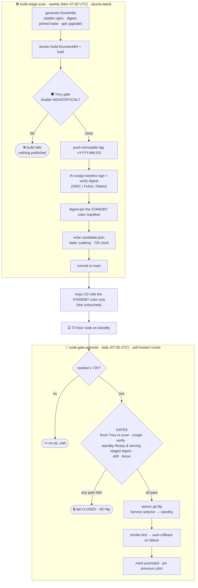

<div align="center">

# 🔵🟢 cicd — GitOps + CI for `greg.heffner.live`

**Weekly build → 3-day soak → gated auto-promote. Zero-downtime blue/green delivery for a self-hosted Kubernetes cluster, with signing verified at the cluster door.**


</div>

---

## 📖 Overview

Every image is digest-pinned, Trivy-gated, cosign-signed, **soaked on the standby color for 72 hours before it can ever serve a live request — and rejected at the cluster door by Kyverno admission if it isn't signed by this repo's build workflow.**

This repository is the **single source of truth** for a self-hosted Kubernetes cluster that serves the static site **`greg.heffner.live`** (nginx) to the public internet through a **Cloudflare Tunnel**.

It holds two things:

1. **GitOps manifests** — the desired cluster state, continuously reconciled by **Argo CD** (auto-sync + selfHeal, tracking `main`).
2. **CI/CD workflows** — GitHub Actions that build a freshly-patched nginx image weekly, vet it, and *automatically* promote it to live traffic only after it survives a multi-day soak.

The headline design goal: **a poisoned, yanked, regressed, or unsigned upstream OS package must never reach a visitor.** Deploys never go straight to live. A new build lands on the *standby* color, soaks for three days, is re-scanned and re-verified, and only then does live traffic flip to it — atomically, with automatic rollback if the post-flip smoke test fails. As a final backstop, a Kyverno **ClusterPolicy in Enforce mode** refuses admission to any `technotuba/nginx` pod that isn't cosign-signed by this repo's build workflow on `main`.

> **Deploys happen by committing to `main`.** Nothing is `kubectl apply`-ed by hand, and no workflow pushes images on a code push — Argo CD reconciles whatever the workflows commit. `main` is branch-protected (force-push and deletion blocked) and `v*` tags are ruleset-protected.

---

## 🧭 Architecture at a glance

```
Internet ──▶ Cloudflare Tunnel ──▶ Service nginx-service
                                   (type: LoadBalancer, externalTrafficPolicy: Cluster)
                                          │
              selector { version: blue | green }   ◀── flipping this selector = switching LIVE color
                  ┌───────┴───────┐
                  ▼               ▼
           Deployment        Deployment
         nginx-web-blue    nginx-web-green
         (prod/, repl 3)    (DR/, repl 3)
                  └───────┬───────┘
                          ▼
         per-color HPA (cpu 70%, 3→10) + PDB (maxUnavailable: 1)  [shared/]
                          ▲
         🛡️ Kyverno admission webhook (Enforce, fail-closed) — every new
            technotuba/nginx pod must be cosign-signed by build-stage-scan@main
```

- **Both colors are Kubernetes `Deployment`s** (`replicas: 3`) in namespace `prod`. Blue lives in `prod/nginx-blue.yaml`; green lives in `DR/nginx-green.yaml`. They are symmetric and equally promotable.
- **The Service selector decides which color is LIVE.** Switching colors means changing `spec.selector.version` on `nginx-service` — nothing else moves.
- **Ingress** is a **Cloudflare Tunnel** that forwards to the `nginx-service` LoadBalancer (`externalTrafficPolicy: Cluster`). Port `81` (`nginx-status`) is exposed for the Datadog nginx check.
- Each pod's **nginx** container is digest-pinned (`technotuba/nginx@sha256:…`, `imagePullPolicy: IfNotPresent`), with an `httpGet / :80` readiness probe, a `preStop` drain, and a surge-first rollout (`maxSurge: 1 / maxUnavailable: 0`) so a rollout never drops below the desired Ready count.
- A **fail2ban** sidecar bans abusive clients via the Cloudflare API, using the real client IP from `X-Forwarded-For` (the Service uses `externalTrafficPolicy: Cluster`, so the real IP comes from the header).
- Per-color **HorizontalPodAutoscaler** (cpu Utilization 70%, min 3 / max 10) and **PodDisruptionBudget** (`maxUnavailable: 1`) live in `shared/`.

### The image

`technotuba/nginx` (Docker Hub, public). Built weekly from `nginx:<STABLE>-alpine-slim` by `.github/scripts/generate_dockerfile.py`, which selects the latest **stable** (even-minor) nginx branch, **pins the base image to an immutable `library/nginx@sha256:…` digest** (so a poisoned upstream re-tag can't silently enter between builds), and runs `apk upgrade --no-cache` to pull patched Alpine OS packages — so the rebuild ships current security fixes even when the upstream base lags.

### GitOps topology (Argo CD)

| Argo CD Application | Source | Tracks |
|---|---|---|
| `heffner-prod` | `prod/` | blue Deployment (`ignoreDifferences` on `/spec/replicas` so HPA scaling doesn't fight selfHeal) |
| `heffner-dr` | `DR/` | green Deployment (same `/spec/replicas` ignore) |
| `shared-services` | `shared/` | Service + HPAs + PDBs + ConfigMaps |
| `kyverno` | Helm chart (sync-wave 0) | the Kyverno controller + CRDs |
| `heffner-security` | `security/` (sync-wave 1) | the `verify-technotuba-nginx` ClusterPolicy |

> All apps run `automated` sync with `selfHeal: true` — so **deploys and color flips go through commits to `main`, never out-of-band `kubectl` edits** (selfHeal would revert them).

---

## 🚦 The pipeline

Two GitHub Actions workflows are the centerpiece. **The weekly build *stages* a candidate on the standby color; after 72h of soak, a daily gated job atomically flips live traffic to it — or no-ops.** The live color is never touched by the build.


```mermaid
flowchart TD
    subgraph WEEKLY["🛠️ build-stage-scan · weekly (Mon 07:00 UTC) · ubuntu-latest"]
        A["generate Dockerfile<br/>(stable nginx · digest-pinned base · apk upgrade)"] --> B["docker build linux/amd64 + load"]
        B --> C{"🛡️ Trivy gate<br/>fixable HIGH/CRITICAL?"}
        C -- fail --> CX(["❌ build fails<br/>nothing published"])
        C -- clean --> D["push immutable tag :vYYYY.MM.DD"]
        D --> E["✍️ cosign keyless sign + verify digest<br/>(OIDC / Fulcio / Rekor)"]
        E --> F["digest-pin the STANDBY color manifest"]
        F --> G["write candidate.json<br/>state: soaking · 72h clock"]
        G --> H["commit to main"]
    end
    H --> I["Argo CD rolls the STANDBY color only<br/>(live untouched)"]
    I --> SOAK["⏳ 72-hour soak on standby"]
    SOAK --> J
    subgraph DAILY["🚀 soak-gate-promote · daily (07:30 UTC) · self-hosted runner"]
        J{"soaked ≥ 72h?"}
        J -- no --> JX(["💤 no-op, wait"])
        J -- yes --> K{"GATES<br/>fresh Trivy re-scan · cosign verify ·<br/>standby Ready & serving staged digest ·<br/>drift · fence"}
        K -- any gate fails --> KX(["🔒 fail CLOSED · NO flip"])
        K -- all pass --> L["atomic git flip<br/>Service selector → standby"]
        L --> M["smoke test → auto-rollback on failure"]
        M --> N["mark promoted · pin previous color"]
    end
```

- **`build-stage-scan`** — weekly. Generates the Dockerfile, builds single-arch, **fails the build on any fixable HIGH/CRITICAL** (Trivy), pushes an **immutable** `:vYYYY.MM.DD` tag (never `:latest` to prod), **cosign keyless-signs and verifies** the digest, digest-pins the standby manifest, and writes the `candidate.json` ledger. Runs on `ubuntu-latest`.
- **`soak-gate-promote`** — daily. No-ops unless a candidate has soaked **≥ 72h**, then runs the gate suite (fresh re-scan, cosign verify, standby health + serving the exact digest, drift/fence checks), performs an **atomic, git-driven Service-selector flip**, smoke-tests, and **auto-rolls-back on failure**. Every gate **fails closed** (no flip). Runs on a `self-hosted` runner with cluster read access for the health gates.

---

## 🔐 Security & supply chain

| Control | What it guarantees |
|---|---|
| **Digest pinning** | prod always references an immutable `@sha256` — never a mutable tag. The base image is digest-pinned too. |
| **Trivy gate** | the build fails on any fixable HIGH/CRITICAL, and the candidate is **re-scanned with a fresh DB** again at promote time. |
| **3-day soak** | a freshly built image runs on standby for 72h before it can serve live traffic — a poisoned/yanked upstream package has time to surface first. |
| **cosign keyless signing** | every image digest is signed via GitHub OIDC (Fulcio/Rekor); the pipeline verifies the signature before it pins or promotes. |
| **Kyverno admission (Enforce)** | the cluster **rejects any `technotuba/nginx` pod not signed by this repo's `build-stage-scan` workflow on `main`** — even a manual deploy. Scoped to this app image; fail-closed. |
| **Repo protection** | `main` blocks force-push/deletion; `v*` tags are ruleset-protected — controlling who can ever produce a trusted signature. |

The trusted signer identity (verified by both the pipeline and Kyverno) is:

```
issuer:   https://token.actions.githubusercontent.com
identity: https://github.com/gregheffner/cicd/.github/workflows/build-stage-scan.yaml@refs/heads/main
```

---

## ⚙️ Workflows

All workflows are GitHub Actions. **None are push-triggered.** `workflow_dispatch` ("Run workflow") is available on every one.

| Workflow | Trigger | What it does |
|---|---|---|
| `build-stage-scan.yaml` | Weekly cron + manual | Build patched nginx → Trivy gate → push immutable tag → cosign sign/verify → digest-pin standby → write ledger. *No cluster mutation.* |
| `soak-gate-promote.yaml` | Daily cron + manual | After ≥72h soak: re-scan, cosign verify, health/drift/fence gates → atomic selector flip → smoke test → rollback-on-failure → mark promoted. *Fails closed.* |
| `clear-cloudflare-cache.yaml` | Scheduled + manual | Cloudflare cache purge. |
| `update-cloudflare-block-badge.yaml` | Scheduled + manual | Updates the Cloudflare-blocks badge above. |
| `delete-kubernetes-pods.yaml` | Manual | Pod cleanup; the bulk sweep excludes the production namespace by design. |
| `log-rotate.yaml` | Manual | Rotates nginx logs. |
| `tunnelrestart.yml` | Manual | Restarts the Cloudflare Tunnel. |
| `push-cloudflare-credentials.yaml` | Manual | Provisions Cloudflare credentials for the fail2ban sidecar. |

---

## ⏱️ Schedule &amp; cadence

Scheduled (cron) triggers for this repo, in **UTC**. Every workflow is **also** `workflow_dispatch`. (Generated from the live workflow definitions via `action-check/github_action_schedule_scraper.py`.)

| Workflow | Cron (UTC) | When | Frequency |
|---|---|---|---|
| `build-stage-scan.yaml` | `0 7 * * 1` | Monday 07:00 | Weekly |
| `soak-gate-promote.yaml` | `30 7 * * *` | Daily 07:30 | Daily |
| `update-cloudflare-block-badge.yaml` | `0 9 * * *` | Daily 09:00 | Daily |
| `clear-cloudflare-cache.yaml` | `59 23 * * 0` | Sunday 23:59 | Weekly |

### Analysis — the weekly patch rhythm

Build and promotion are **deliberately decoupled by a 72-hour soak**, so one patch flows to live traffic across the week. The build only ever touches the **standby** color; the daily promote job is what eventually flips live:

| When (UTC) | Event | Effect |
|---|---|---|
| **Mon 07:00** | `build-stage-scan` | Builds → Trivy-gates → cosign-signs the patched image, **pins it to the standby color**, starts the 72h soak clock. Live color untouched. |
| Mon 07:00 → Thu 07:00 | ⏳ **72h soak** | Standby runs the new digest; each daily promote **no-ops** (candidate not yet eligible). |
| **Thu 07:30** | `soak-gate-promote` (first eligible run) | Soak satisfied → full gate suite → **atomic traffic flip to standby**, or **fails closed**. |

A **Monday build becomes live on Thursday ≈07:30 UTC** — an effective **build-to-live interval of ≈3 days (72h soak + the 30-min offset to the next daily promote window)**. The other six daily `soak-gate-promote` runs each week are intentional no-ops whose only job is to catch a candidate the moment it clears soak.

### Intervals

| Interval | Value | Between |
|---|---|---|
| Build cadence | **7 days** | each `build-stage-scan` (Mon 07:00) |
| Soak before promote-eligible | **72h** | build (Mon 07:00) → eligible (Thu 07:00) |
| Promote-check cadence | **24h** | each `soak-gate-promote` (07:30); promotes only a candidate past its soak |
| **Build → live** | **≈72.5h** | Mon 07:00 build → Thu 07:30 flip (normal weekly flow) |
| Cloudflare cache purge | **7 days** | `clear-cloudflare-cache` (Sun 23:59) |
| Block-badge refresh | **24h** | `update-cloudflare-block-badge` (daily 09:00) |

> Off-schedule, the same path runs via manual `workflow_dispatch` of `build-stage-scan` then `soak-gate-promote` (once the candidate has soaked).

---

## 🗂️ Repository layout

```
.
├── prod/      nginx-blue.yaml         # BLUE Deployment — Argo CD app: heffner-prod
├── DR/        nginx-green.yaml        # GREEN Deployment — Argo CD app: heffner-dr
├── shared/    nginx-service.yaml      # Service (selector = LIVE color) + HPAs + PDBs + ConfigMaps
├── security/  verify-nginx-signature.yaml   # Kyverno cosign ClusterPolicy
│              kyverno-app.yaml · heffner-security-app.yaml   # Argo CD apps
├── .github/
│   ├── workflows/                     # the two pipeline workflows + ops workflows
│   ├── scripts/generate_dockerfile.py # weekly Dockerfile generator
│   └── state/candidate.json           # promotion ledger (soaking → promoting → promoted)
└── README.md
```

---

## 🛟 Operations & resilience

The pipeline is designed to **fail safe**, and recovery is git-driven:

- **Every promotion gate fails closed** — if a re-scan, signature check, health check, drift check, or fence fails, traffic does **not** flip and the live color keeps serving.
- **Automatic rollback** — if the post-flip smoke test fails, the promote workflow reverts the selector commit and confirms the rollback landed.
- **Instant manual rollback** — the previous color stays running (pinned to its digest), so reverting the promote commit returns traffic to it within an Argo CD sync.
- **Documented break-glass** — there are procedures to expedite a patch ahead of the soak window and to temporarily relax the admission policy during a signing-infrastructure outage.

> Detailed operator runbooks and internal topology are intentionally **not** published in this public repository.
